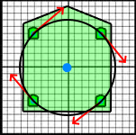

Spinning in Place
=================

So we have a working swerve drive robot! Wow!  
But, as I said in the last task, this is not a good solution. We never want our wheels dragging with swerve drive.
Dragging wheels are at best inefficient, and at worst a really good way to break a bunch of (definitely not 3d printed)
parts and leave us stranded in the middle of the field.

There's one more piece of the puzzle that we haven't looked at yet, and it goes back to the work we did on better arcade drive.  
In better arcade drive, we figured out how to make a robot with wheels that were exclusively along the x axis spin in place properly.
What was special about this wheel configuration is that when the wheels are all pointing forwards (as a non-swerve robot would),
they are _tangent_ to the circle about the center of the robot that they lie on, as shown below:  
  
(the inner wheels are the same, but the circle was omitted for simplicity)

Moving from this robot to a square robot, we immediately notice the problem:  
  
Uh oh, the tangent vectors are now pointing in directions that aren't up or down, so we're gonna have to swivel the wheels!
  
Fortunately, it's pretty easy to figure out how to swivel the wheels, with more Vector Math!
For each wheel, just take the vector from the center of the robot to the wheel, then make a vector perpendicular to it.  
This is really easy in 2d, if you don't know how, Google it or just take my answer: (x, y) turns into (-y, x).

The last thing to think about is when not all the wheels are the same distance from the center of the robot.
You'll have to handle that just like in better arcade drive. This picture of the square six drivetrain will show what you have to think about:  

Don't worry about translating the robot. Once this works correctly, the center of the robot should never move at all.
This only requires one joystick axis to control. I used the horizontal axis of the left stick, but it doesn't really matter.

Just like Translational Swerve, this should also work on every robot design, so make sure to thoroughly test it.
